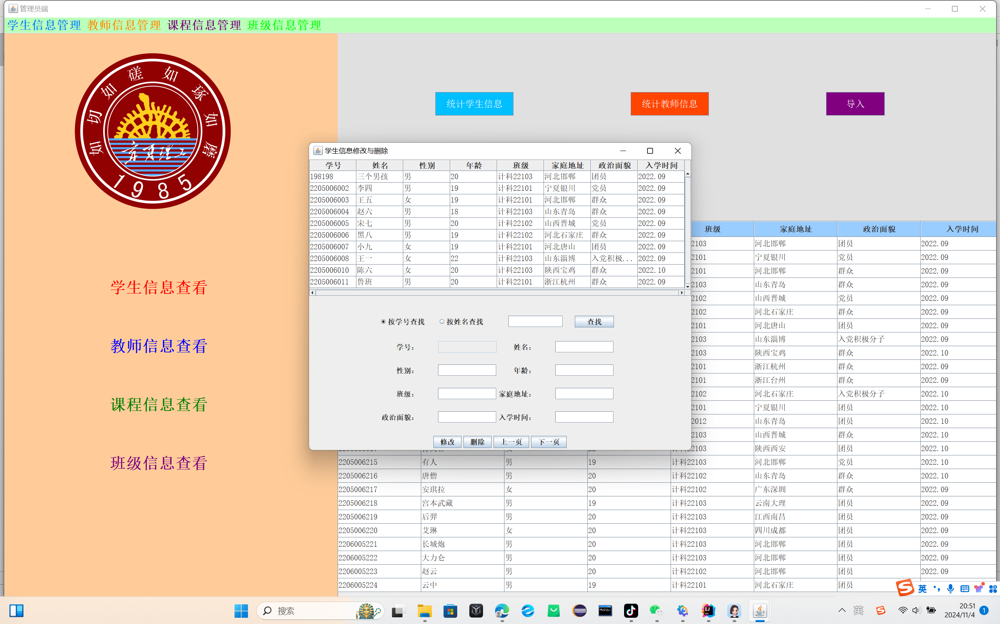
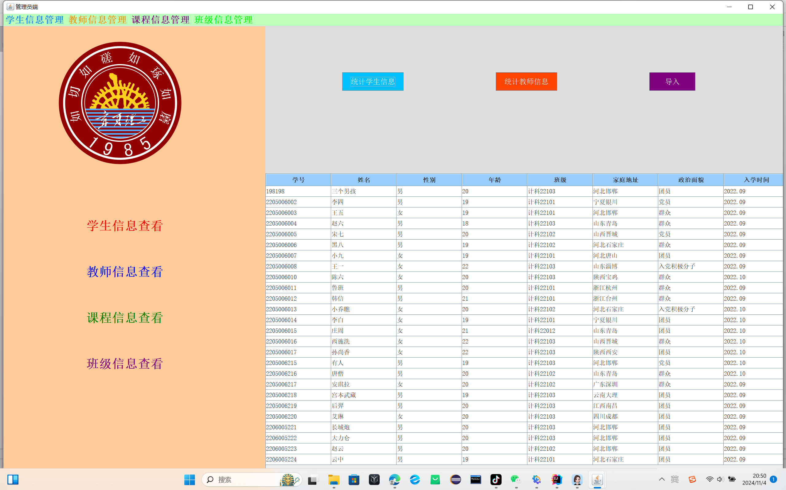

# student-information-management-system
这是一个用Java语言编写的学生信息管理系统，具备基本的增删改查功能和其他的创新功能。

##使用说明
src文件中存放所有该信息系统所对应的Java界面，并且lib文件中存放着相关的依赖驱动，下载即可用。
代码中有些界面的图片可能加载不出来，因为该项目在写的时候使用的是绝对路径而不是相对路径，所以需要把所引用图片文件下载到本地后重新在代码中插入图片。
通过登录界面输入数据库对应的账号和密码即可进入学生信息系统进行你想要的操纵。管理员和老师将会有不同的操作权限
